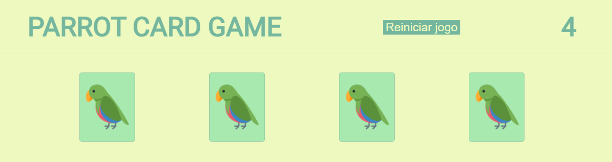

#    :black_joker: Jogo da memória de papagaios muito loucos :bird:

> Página desenvolvida utilizando **CSS**, **HTML** e **JavaScript vanilla**. 

Acesse a página clicando **<a href="https://mateuskuritza.github.io/Projeto4_JogoDaMemoria/">AQUI</a>**

​																									Preview do jogo

#### :wrench: ​​Principais pontos: 

+ Efeito 3D do giro das cartas;
+ Número de cartas escolhidos pelo usuário de 2 à 7 pares;
+ Botão de reiniciar o jogo;
+ Cronometro para contagem do tempo de jogo;
+ Contagem do número de jogadas.

##### :page_with_curl: ​Fontes úteis para o desenvolvimento desse projeto: 

> Para a organização do layout: <a href="https://css-tricks.com/snippets/css/a-guide-to-flexbox/">Flex-Box</a>

> Conhecimentos úteis do JavaScript: <a href="https://www.w3schools.com/jsref/met_document_queryselector.asp">.querySelector</a>, <a href="https://www.w3schools.com/js/js_this.asp">this</a>, <a href="https://www.w3schools.com/jsref/met_win_settimeout.asp">setTimeout()</a>, <a href="https://www.w3schools.com/jsref/met_win_setinterval.asp">setInterval()</a> e <a href="https://www.w3schools.com/jsref/jsref_sort.asp">.sort()</a>

### Instruções de uso:

  1. Clone esse repositório
  2. Execute o arquivo index.html
